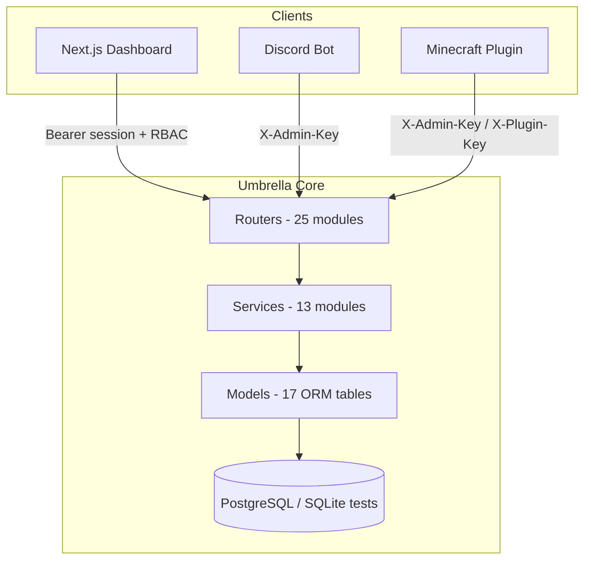

# UmbrellaMC Architecture Report

**Generated:** 2026-06-22  
**Scope:** Full repository reconstruction pass

## System Overview

UmbrellaMC is a multi-client Minecraft network operations platform:

| Component | Path | Stack |
|-----------|------|-------|
| Dashboard | `Dashboard/` | Next.js 16, React 19, TanStack Query 5, shadcn/ui |
| Umbrella Core | `files/umbrella-core/` | FastAPI, SQLAlchemy 2 async, Alembic, PostgreSQL |
| Discord Bot | `discord-bot/` | py-cord 2.4+, httpx |
| Minecraft Plugin | `minecraft-plugin/` | Paper 1.20.4, Java 17, OkHttp (shaded) |

## Architecture Diagram



## Layered Backend Structure

```
umbrella-core/
├── main.py              # Lifespan, CORS, router mounting
├── api/routers/         # 25 routers, ~105 endpoints
├── api/dependencies/    # RBAC (require_permission, require_owner)
├── api/middleware/      # API keys, session auth, error handlers
├── services/            # Business logic
├── models/              # SQLAlchemy ORM
├── alembic/versions/    # 11 migrations (001–011)
└── tests/               # 200 pytest tests
```

## Service Dependency Graph

```
SettingsService ← anticheat, ai, ai_config, translation, server_control, auth, plugin, bridge
RolesService    ← startup seed only
analytics_service, replay_service, snapshot_service ← respective routers
ai_service      ← ai_tasks, anticheat_service
alt_detection_service, discord_service, staff_service, server_control_service, translation_service
```

## Cross-System Integration Points

| Flow | Protocol | Auth |
|------|----------|------|
| Dashboard → Core | REST `/api/v1/*` | Bearer session token |
| Bot → Core | REST `/api/v1/*` | `X-Admin-Key` |
| Plugin → Core | REST `/api/v1/*` | `X-Admin-Key` (config) |
| Plugin heartbeat | `POST /api/v1/plugin/heartbeat` | Plugin key |
| MC command queue | `GET /api/v1/mc/commands/pending` | Admin key |
| Bridge chat | `POST/GET /api/v1/bridge/*` | Mixed |

## Database Entity Relationships

**Strong FKs:** Player → IPAddress, Punishment, Appeal; User → Session; Role ↔ Permission (M2M); ReplaySession → ReplayEvent; AltGroup → AltGroupMember; DiscordAccount → Player.

**Loose UUID refs (no FK):** AnalyticsEvent, SuspicionEvent, VerificationCode, AITask, MCCommand, PlayerLanguage, PlayerSnapshot (partial).

## Reconstruction Changes (This Pass)

1. **Unified RBAC** — Dashboard-facing GET endpoints migrated from `require_admin_key` to `require_permission()` for session users.
2. **Auth enrichment** — `/auth/me` returns `role` name and `permissions[]`.
3. **Dead code removed** — `api/middleware/permissions.py`, `services/api.ts`.
4. **CORS fix** — `allow_credentials=False` (valid with wildcard origins).
5. **Session timezone** — Fixed `Session.is_valid()` comparison.
6. **Cross-client fixes** — Heartbeat re-enabled, Discord event polling deduplicated, moderation.py corruption repaired.

## Remaining Architecture Debt

| Item | Priority | Notes |
|------|----------|-------|
| `PluginCommand` model | High | No Alembic migration; plugin control not polled |
| `PluginHeartbeat` table | Medium | Created via `create_tables()` only |
| Redis caching | Low | Documented but not implemented |
| `create_tables()` on startup | Medium | Use Alembic-only in production |
| Dashboard route guards | Medium | Client-side only; no Next.js middleware |
| Centralized Pydantic schemas | Low | Schemas co-located in routers |

## Folder Map

```
new folder/
├── Dashboard/           # Next.js staff dashboard (24 routes)
├── discord-bot/         # Moon-Bot Discord integration (12 cogs)
├── files/umbrella-core/ # FastAPI backend
├── minecraft-plugin/    # Paper plugin
├── docs/                # Blueprint + reports
├── setup.sh             # Bootstrap script
└── files/README.md      # Deployment docs
```
